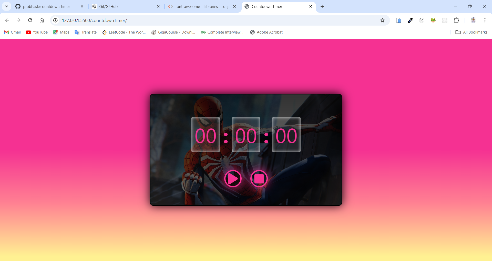

# Countdown Timer

## Project Overview
The **Countdown Timer** is a simple web-based timer application that allows users to input a specific time and start counting down. It features options to play, pause, and reset the timer. A popup message is shown when the time is up or if an invalid time is entered.

## GitHub Pages Deployed Link
[Visit Live Project 🔗](https://probhask.github.io/countdown-timer/)
```bash
https://probhask.github.io/countdown-timer/
```



## Features
- **Set Countdown Time**: Users can input hours, minutes, and seconds to set the countdown timer.
- **Start and Pause**: Users can start and pause the countdown.
- **Reset Timer**: Users can reset the timer to its initial state.
- **Popup Messages**: The application shows pop-up messages when the timer ends or when invalid input is entered.
- **Responsive Design**: The timer interface is designed to be responsive and works well across various screen sizes.

## Technologies Used
- **HTML5**: For structuring the application layout.
- **CSS3**: Used for styling, including responsiveness and animations.
- **JavaScript (ES6)**: Handles the core logic, including input validation, time countdown, and user interactions.
- **Font Awesome**: Used for the icons in the play, pause, and reset buttons, as well as for the popup icons.
- **LocalStorage**: Stores the input values locally to maintain the current state between sessions.

## File Structure
- **index.html**: The main file that contains the HTML structure of the countdown timer.
- **style.css**: The stylesheet that defines the styles, layout, and responsiveness of the timer.
- **script.js**: The JavaScript file that handles the functionality of the countdown timer, including starting, pausing, resetting, and displaying pop-up messages.

## How to Use
1. **Set the Time**: Input the desired hours, minutes, and seconds using the input fields.
2. **Start the Timer**: Click the play button to start the countdown.
3. **Pause the Timer**: Click the pause button to pause the countdown at any point.
4. **Reset the Timer**: Click the stop button to reset the timer to the initial values.
5. **Popup Notifications**: A popup will notify when the time is up or if there are invalid inputs.

## Installation
1. Clone the repository or download the project files.
2. Open the `index.html` file in your web browser.
3. No additional installations or setup are required.

## Example Usage
1. Open the application in a browser.
2. Set a time by entering the values in hours, minutes, and seconds.
3. Click the play button to start the timer.
4. You can pause and reset the timer as needed.

## Future Enhancements
- **Sound Notifications**: Add sound effects when the countdown reaches zero.
- **Custom Backgrounds**: Allow users to change the background image of the timer.
- **Custom Themes**: Provide multiple theme options (light/dark mode).
- **Time Validation**: Improve time validation to restrict inputs dynamically.


